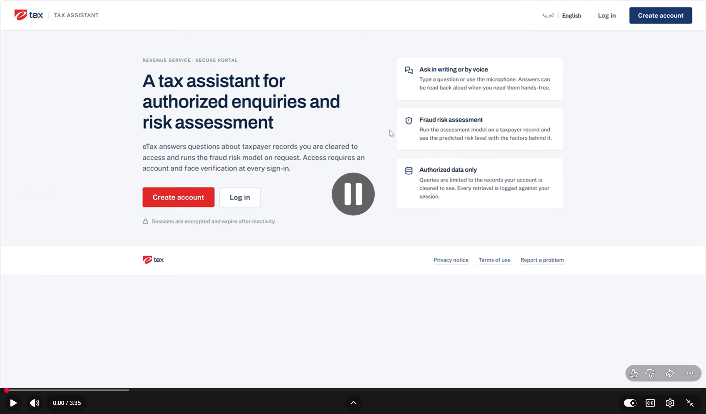
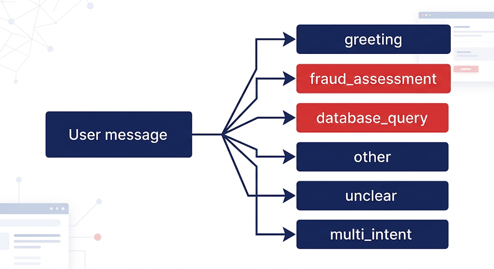
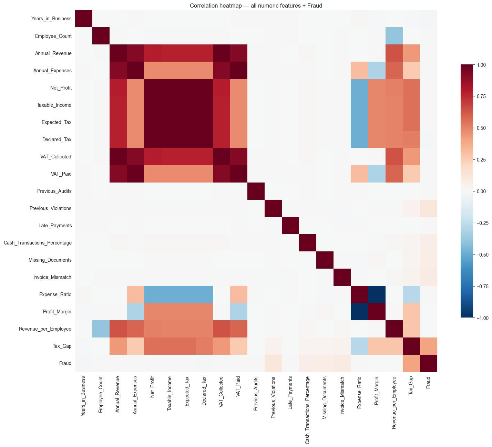
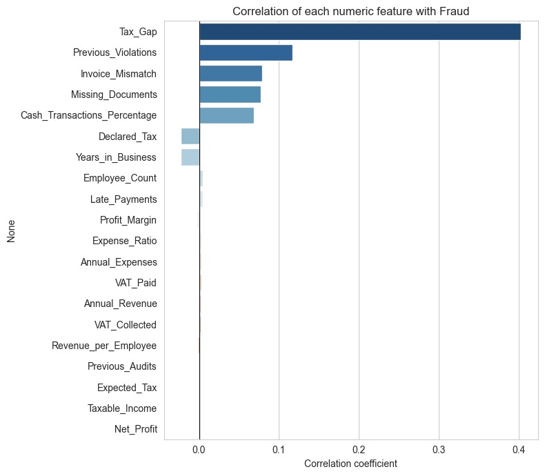
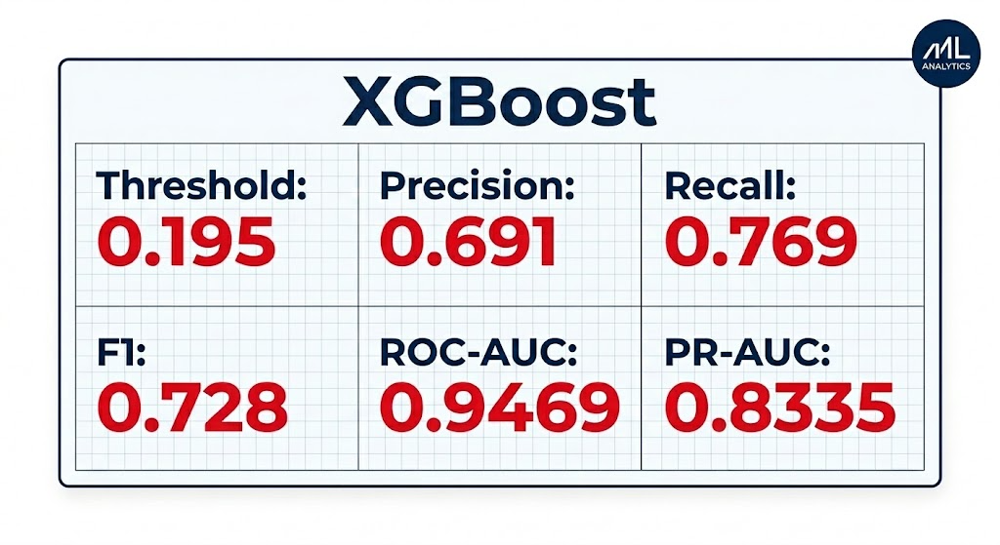
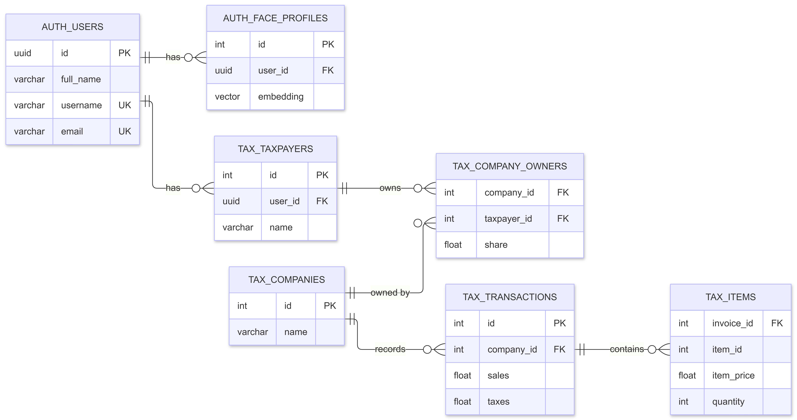
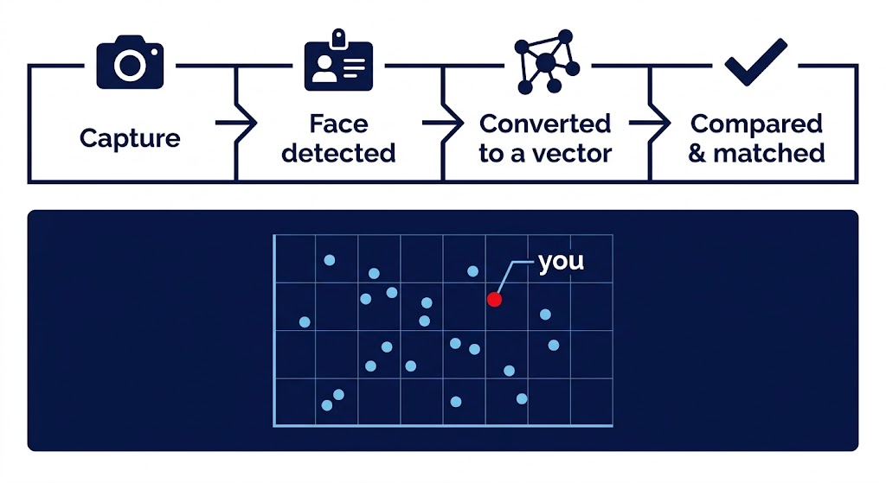

# eTax — AI-Assisted Tax Platform

*The digital taxation hub.* eTax is an end-to-end AI-powered tax platform
designed to simplify and modernize how taxpayers interact with tax services.
It combines secure biometric identity verification, conversational access to
a taxpayer's own authorized records, and machine-learning-driven fraud-risk
assessment into a single guided workflow — with every sensitive decision
enforced by the database itself, not just trusted to whatever a language
model happens to say.

[](https://youtu.be/u1ywiZGVsxU)

**[Watch the 3:35 demo video](https://youtu.be/u1ywiZGVsxU)** — sign-up, face
verification, fraud-risk assessment, and the chat agent, end to end.

---

## The problem

Filing taxes the traditional way is a hassle. A taxpayer trying to check a
record, confirm a filing, or understand their own risk exposure typically
has to stand in a queue, assemble a stack of paperwork, and lose hours per
visit — and every manual handoff in that process is another chance for
human error. A reliable process should leave no room for mistakes, but the
manual version rarely does: information that already exists somewhere in
the system is still hard for the person it belongs to to actually reach,
verify, or act on.

## The solution

eTax is not a chatbot placed in front of a database. It is an **intent
router with judgment**: every message is first classified by what kind of
help it's actually asking for, and only then does the system check who is
asking and what that specific person is allowed to see — enforced
independently at the backend and database layer, at every step, regardless
of what the frontend shows or what an LLM in the pipeline decides to
generate.

Concretely, the platform is built from six pieces working together:

- an **AI Tax Agent**, orchestrated with LangGraph, that routes each message
  to the right workflow and can pause a multi-step process and resume it
  exactly where it left off;
- a **fraud detection ML model**, trained on real tax data, that scores a
  taxpayer's own record for risk of misreporting;
- a **secure SQL agent** that lets an LLM answer free-form questions about a
  taxpayer's own records without ever being able to see or return another
  taxpayer's data, enforced by database views, Row-Level Security, and
  scoped grants rather than by the model's good behavior;
- **face recognition with anti-spoofing**, so every sign-in is backed by a
  liveness-checked biometric match, not just a password;
- **bilingual speech input and output**, in Egyptian Arabic and English,
  including switching languages mid-conversation; and
- a **FastAPI backend, containerized with Docker**, so the whole stack comes
  up with one command and every provider/model choice is configuration, not
  hardcoded logic.

Each of these is covered in more depth below.

---

## Core capabilities

### Conversational AI agent

The chat agent is a [LangGraph](https://github.com/langchain-ai/langgraph)
state machine, not a single prompt. Every incoming message is classified
into one of six intents and handed to a dedicated node:



Before any of that classification ever calls an LLM, a **deterministic
pre-router** checks for a handful of unambiguous signals first — an exact
standalone greeting ("Hi", "مرحبا"), a pasted dump of the fraud model's own
field names, or an explicit fraud-related keyword in Arabic or English. Any
of those route straight to the matching node with zero model calls; only a
genuinely ambiguous message reaches the classifier. This exists because
production testing showed the opposite approach — always asking the model —
occasionally let a real fraud or database request get swallowed by a vaguer
"general conversation" bucket instead of being handled.

The **fraud-assessment** and **database-query** paths are fully real,
end-to-end workflows (not placeholders): a fraud review can be interrupted
mid-way (for example, waiting on the user to confirm or flag a value) and
resumed later exactly where it paused, because the graph's state is
checkpointed per conversation thread. The remaining four intents
(`greeting`, `other`, `unclear`, `multi_intent`) answer from curated,
bilingual response templates rather than a model call — there's no value in
spending an LLM request to say "hello" back.

### Fraud detection model

The fraud model is trained on a real tax dataset in which only **10.7%** of
records are actually fraudulent — a meaningfully imbalanced target, which
shapes how the model is built and evaluated.



An outlier in this data isn't automatically a bad signal: an extreme value
can mean a genuinely large company, an unusual but entirely valid
transaction, or a real fraud indicator. That full correlation view is what
guided feature engineering — which ratios were worth deriving, which raw
fields were redundant, and which stood on their own. Looking specifically at
each feature's correlation with the fraud label narrows that down further:



`Tax_Gap` (the difference between declared and expected tax) is by far the
strongest single correlate, followed by prior violations, invoice
mismatches, missing documents, and the share of cash transactions — exactly
the kind of signals a human auditor would look for first.

The deployed model is a single **XGBoost** classifier trained on the full
23-feature record (not a partial subset), evaluated with **recall
prioritized over precision** on purpose: a false negative — fraud that
passes through completely undetected — is treated as strictly worse than a
false positive — an unnecessary review that a human can still catch and
clear. The tuned decision threshold and the resulting metrics:



In the running app, this model never sees data typed or pasted by the user.
Every field is pulled from the taxpayer's own linked record in the
database, shown back to them **read-only** for confirmation (or for
flagging a specific value as wrong, which queues it for a tax-authority
review rather than letting the user edit it directly), and only then scored.
The result is reported as a plain risk **percentage** against the tuned
threshold above — never a bare "fraud" or "not fraud" verdict.

### Secure SQL agent

`database_query` is the other fully real path, and it's the part of the
system with the most deliberate security engineering behind it. The
underlying schema — one Postgres database, an `auth` schema for accounts and
face embeddings, and a `tax` schema for taxpayers, companies, ownership,
transactions, and line items — looks like this:



A taxpayer's relationship to a company is a **share**, not a flag — the same
person can hold a majority stake in one company and a minority stake in
another, and what data they're allowed to see is evaluated per company, per
request, never as one global permission tier for the whole account.

The request pipeline is planned and authorized *before* any SQL is ever
generated, not audited afterward:

```
message → extract a plan (LLM: which fields/metrics, which companies mentioned)
        → resolve company mentions (Python, fuzzy-matched against ONLY this user's own companies)
        → authorize every requested field/metric against each resolved company's access level
        → answer directly when possible, or generate SQL scoped to exactly what was authorized
        → validate the SQL as a real parse tree (not a string check)
        → execute as an unprivileged Postgres role, under Row-Level Security
        → typed result → localized response
```

Three layers back this up inside Postgres itself, so the guarantee holds
even if a model in the pipeline generates something malicious or simply
wrong:

1. **Secure views**, created with `security_invoker = true` and filtered by
   the session's own `app.current_user_id` — a majority-share view exposes
   sales, tax, and line-item detail; a minority-share view exposes tax
   obligations only, with sales redacted and no line-item access at all, by
   the view simply not existing for that grain rather than being filtered
   out after the fact.
2. **Forced Row-Level Security** on the base `company_owners`, `transactions`,
   and `items` tables, so row access is enforced by the database session
   configuration itself — not by trusting an ID the LLM or the request
   happened to mention.
3. **Role segregation** — every piece of LLM-generated SQL executes as
   `app_agent`, a non-superuser role with `NOBYPASSRLS`, narrowly scoped
   `SELECT` grants, and zero access whatsoever to the `auth` schema. The
   table-owning role (which *is* a superuser, and therefore bypasses RLS
   entirely) never runs a user's request.

A generated query that fails to execute gets exactly one automatic repair
attempt, regenerated from scratch with the database's own error fed back in;
a query that fails *validation* (touching a forbidden relation, attempting a
write, multiple statements) is never repaired, since that's a security
signal, not a syntax slip.

### Face recognition and liveness

Every sign-in is a two-stage check, enforced by the backend on every
request rather than just hidden behind frontend routing: a password first,
then a face match, and neither stage's token unlocks the other stage's
endpoint.

Face identity is not exact-pixel matching — a face is converted into a
512-dimensional embedding, and verification measures the distance between
that embedding and the one recorded at enrollment:



The embedding model is **ArcFace** (`buffalo_l`, via InsightFace), and
matching uses cosine distance against a configurable threshold
(`MATCH_THRESHOLD`, default `0.45`). Verification never runs a
nearest-neighbor search across every enrolled user — it fetches only the one
embedding belonging to the authenticated token's own user and compares
against that record alone, so there's no scenario where one person could be
matched against someone else's face by mistake.

Before any embedding is produced, a passive **liveness** check
(MiniFASNetV2, threshold `0.85`) has to pass first — a photo, a screen
replay, or a print of someone's face is rejected before it ever reaches the
matching step. This defends against presentation attacks specifically; it's
one layer of identity assurance, not a complete anti-fraud guarantee against
more sophisticated spoofing.

### Bilingual voice

Voice is a presentation-layer add-on around the same text-based agent, not
a separate code path — the agent always produces its answer as text first,
and speech is layered on top of that in both directions.

Speech-to-text is a **two-role pipeline**, because no single provider used
here does both jobs well: Cohere's transcription API has no
language-auto-detect mode at all, while Groq's Whisper endpoint reliably
detects the spoken language but transcribes slightly less accurately in
practice. So every voice message runs through Groq first purely to identify
the language, then through Cohere for the actual transcript in that
language — falling back to Groq's own transcript if Cohere is unavailable.
This combination is what lets a user speak English, speak Arabic, or switch
between the two across messages, and still get an accurate transcript
either way.

Text-to-speech tries multiple providers in a configurable fallback order
(Gemini, then `edge-tts`, then ElevenLabs by default), with independent API
key rotation within Gemini itself so a single rate-limited key doesn't stall
a reply — a failure at this layer never blocks or changes the text answer
already shown, since speech is requested as a separate step afterward. The
Egyptian Arabic voice (`ar-EG`) is used specifically, rather than generic
Modern Standard Arabic, so spoken replies sound natural to the dialect most
users actually speak.

### Backend and infrastructure

The backend is **FastAPI**, backed by a single **PostgreSQL + pgvector**
database (face embeddings and tax data both live there, in separate
schemas), and every provider/model choice — which LLM to try first, which
STT/TTS providers to use, cooldown durations, thresholds — is read from
environment variables, never hardcoded into route or node logic. The entire
stack (database, backend, frontend, and pgAdmin for inspecting the database)
is defined in one `docker-compose.yml` and comes up with a single command.

---

## Architecture at a glance

```
Sign up (+ claim a linked tax record) → enroll face (liveness-gated)
   → every login re-verifies your face → chat

Chat message → intent router decides:
   fraud assessment  → pulls YOUR linked record → XGBoost scores it → risk %
   database query    → LLM writes SQL scoped to companies you actually own
                         → executed under Postgres RLS as an unprivileged role
   everything else   → answered from curated templates, no LLM guesswork
```

The design deliberately separates what the language model is trusted with
from what only code and the database ever decide:

| The LLM handles | Code and the database decide |
|---|---|
| Interpreting a message, classifying intent | User permissions |
| Extracting values, phrasing an answer | Missing-value / interrupted-workflow handling |
| Generating scoped SQL | The fraud prediction itself |
| Summarizing results | What data is actually returned |

The model never gets to invent a fact on its own: fraud risk always comes
from the trained model's prediction, and database answers are grounded only
in rows Postgres actually returned for that specific, already-authorized
query.

For the complete technical reference — full schema definitions, the
LangGraph state machine, provider fallback internals, and the security
pipeline in full detail — see **[CLAUDE.md](CLAUDE.md)**.

---

## Try it yourself

### 1. Configure your environment

```bash
cp .env.example .env
```

You must create this `.env` file yourself before running anything — it is
git-ignored on purpose, since it holds real secrets, so it does not exist in
a fresh checkout. Open it and fill in at least:

- `JWT_SECRET_KEY` — any long random string
- `COHERE_API_KEY`, `GROQ_API_KEY`, `GEMINI_API_KEY` — needed for the chatbot
  (speech-to-text, LLM calls, text-to-speech). `.env.example` documents how
  to add extra fallback Gemini keys if you have more than one.
- `ELEVENLABS_TTS_KEY` — optional (Gemini and `edge-tts` cover text-to-speech
  if this is left empty)

### 2. Run it

```bash
docker compose up --build
```

- Frontend: http://localhost:5173
- Backend / Swagger docs: http://localhost:8000/docs
- pgAdmin: http://localhost:5050 (`admin@etax.com` / `admin123`)

The first build takes a while — it bakes the InsightFace (`buffalo_l`) and
MiniFASNetV2 liveness models into the backend image.

### 3. Try face recognition and the fraud model

Every account is linked to one real record from the training dataset via a
one-time **9-digit claim code**, entered at signup — this is the record the
fraud model actually scores, and it is never typed or pasted into the chat,
only confirmed or flagged. Use this pre-seeded demo code to try it yourself:

```
Claim code: 309295275
```

1. Go to **http://localhost:5173 → Create account** — any name, username,
   email, and password you like — and enter the claim code above as your
   *tax record code*.
2. Enroll your face when prompted (this needs camera access — browsers only
   allow that on `localhost` or HTTPS, which is why running it locally on
   `localhost:5173` works without any extra setup).
3. Log back in — you will be asked to verify your face against that same
   enrollment before you can chat.
4. In the chat, ask it to assess your fraud risk. It pulls the real record
   behind your claim code and runs the trained model live, not a canned
   response.

A claim code can only be linked to one account. If `309295275` has already
been claimed by an earlier test run, reseed the database (drop the Docker
volumes and run `docker compose up --build` again) or claim a different,
still-unclaimed code from the `tax.fraud_records` table.

### Don't want to run it locally?

The **[demo video](https://youtu.be/u1ywiZGVsxU)** above walks through this
exact flow — sign-up, face verification, and a live fraud assessment — end
to end, with nothing to install.

If you would rather interact with the running app without installing Docker
on your own machine, this should also work in **GitHub Codespaces**: open a
Codespace on this repo, run the same two commands from steps 1–2 inside it,
then open the forwarded `5173` port. Codespaces serves forwarded ports over
HTTPS, which satisfies the same camera-access requirement `localhost` does
locally. This path hasn't been verified against the free-tier machine size —
the backend image is sizable, since it bakes in the face-recognition models
at build time — so a larger Codespace machine type may be needed for a
smooth build.

---

## Project structure

```
backend/                 FastAPI API — auth, face enrollment/verification, chat agent, PostgreSQL+pgvector
frontend/                React (Vite) — the eTax design system + product pages
docs/                    Deep-dive docs: chatbot flow, codebase review, debugging guide, presentation script
docs/assets/             Diagrams and screenshots used in this README
ml_artifacts/            Source fraud-model artifacts (dataset, feature importance, encoders) —
                          the copies actually used at runtime live in backend/app/chat/fraud/{models,data}/
system_design_UI.zip     Source design system the frontend was ported from
Presentation.pptx        The slide deck this project was demoed from, and the source of the diagrams above
docker-compose.yml       db + backend + frontend + pgAdmin
.env.example             Template for every required API key/config — copy to .env and fill in
CLAUDE.md                Full technical architecture reference
```

## Documentation

- **[CLAUDE.md](CLAUDE.md)** — full architecture reference (schemas, the
  LangGraph agent, provider fallback, the security pipeline)
- **[docs/CHATBOT_DETAILED_FLOW.md](docs/CHATBOT_DETAILED_FLOW.md)** — the
  chatbot's turn-by-turn flow
- **[docs/CODEBASE_REVIEW.md](docs/CODEBASE_REVIEW.md)** and
  **[docs/DEBUG_GUIDE.md](docs/DEBUG_GUIDE.md)** — codebase walkthrough and
  troubleshooting notes
- **[docs/PRESENTATION_SCRIPT.md](docs/PRESENTATION_SCRIPT.md)** and
  **Presentation.pptx** — the narrated deck this project was demoed from
